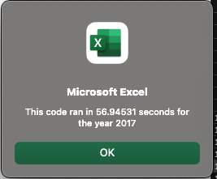
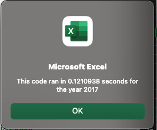

# VBA Stock Analysis

## Introduction
For this challenge, the first deliverable consisted of refactoring the Module 2 solution code to collect the same information in a more efficient manner. In Module 2, we were asked to use Visual Basic for Applications (VBA), a programming language for Microsoft Office applications, to facilitate complex analyses of multiyear stock data contained in an Excel file called green_stocks.xlsx. Our client, Steve, is familiar with Excel, but the file green_stocks.xlsx contains thousands of rows of data for which VBA can be used to automate certain tasks. In this summary, I will compare how I employed VBA in Module 2 and this VBA Challenge to provide Steve with the data he needs to advise his parents on their investments as well as compare stock performance between 2017 and 2018. I will also use a comparison of the execution run times of the Module 2 solution code in green_stocks.xlsm versus the refactored code in VBA_Challenge.xlsm as a gauge of the code’s efficiency. Finally, I will discuss the advantages and disadvantages of refactoring code and how each applies in the context of refactoring my original VBA script.
## Analysis
Both the Module 2 solution code and VBA Challenge code provide the same results for each stock for 2017 and 2018, however, these results were obtained with markedly different run times. For example, the run time of the Module 2 All Stocks Analysis code for 2017 stocks data was 56.95 seconds (Image 1) compared to just 0.12 seconds (Image 2) using the refactored code as modified for the VBA Challenge. Similarly, the All Stocks Analysis of 2018 data was completed in 56.62 seconds using the Module 2 solution code (Image 3) versus 0.13 seconds using the VBA Challenge refactored code (Image 4). See the Resources folder within VBA Challenge for screenshots of the All Stocks Analysis code run times for the Module 2 solution code versus VBA Challenge code for 2017 and 2018 (as well as images referenced throughout the remainder of this document).

##### Image 1

At a glance, the majority of stocks performed more favorably in 2017 compared to 2018 (Images 5 – 8). This is evident because with both the Module 2 solution code and the refactored code in VBA Challenge, Excel was instructed to color the cells with a return greater than zero in green and those with a return less than zero in red. Thus, the return was “green” or greater than zero for every stock except TERP in 2017 (Image 6) whereas in 2018 only ENPH and RUN performed favorably or with a return greater than zero (Image 8). With the exception of TERP (and the previously discussed ENPH and RUN), which performed negatively in both 2017 and 2018, the remaining stocks switched from earning positive returns in 2017 (Image 6) to negative returns for 2018 (Image 8).
## Code
Both the Module 2 solution code and VBA Challenge refactored code begin with a declared subroutine as well as a variable for tracking the run time (Images 9 and 10). Both also activate the worksheet that will be used to display the data output for each analysis. While both solutions encode an InputBox that will be used to ask the user which year he or she wishes to analyze, the Module 2 solution code explicitly declares a string, “yearValue”, to hold this value whereas the refactored code in VBA Challenge does not (Images 11 and 12).

The original and refactored code both go on to start the timer after the user enters his or her desired year, encode the same value for A1, assign the same column titles in their respective header rows, initialize arrays of the same name for the stock tickers and assign the same stocks to their respective indices within the ticker array. From there, the original code declares variables for the starting and ending prices then both sets of code activate the worksheet that corresponds to the user’s desired year of analysis, and get the number of rows to loop over (Images 13 and 14). At this point, the Module 2 solution code begins to run through nested loops using the index i to loop from array position 0 to 11 and setting the initial volume to zero (Image 15). By contrast, the refactored code first creates a ticker index as well as 3 output arrays, one each for tickerVolume, tickerStartingPrice, and tickerEndingPrice. It also then begins to run through nested loops and begins with the index i to set the value of each index of the tickerVolumes array to zero (Image 16).

The next loop for the Module 2 solution and VBA Challenge code uses the index j to loop from the first row of stock data through the previously determined number of rows to loop over. At this point, each set of code uses the loop to get the total volume for the stock assigned to the current ticker. The Module 2 solution code achieves this by using an if then statement that uses the index j to add get the current ticker volume. The refactored, VBA Challenge code does so by using the tickerIndex to output the current ticker volume to the tickerStartingPrice array. Both sets of code then go on to determine the ticker starting price. Module 2 solution code uses an if then statement to evaluate whether the current row’s ticker is equivalent to the ticker corresponding to the current position within the ticker array. If so, then it evaluates whether the current row’s ticker is equivalent to the previous row’s ticker. If not, then the code assigns the current row’s closing value as the current starting price (Image 17). The VBA Challenge code uses an if then statement to determine the whether the ticker value of the previous row does not equal the ticker value corresponding to the current tickerIndex. If they are not equivalent, then the code outputs the closing value to the index of the tickerStartingPrices array that corresponds to the current tickerIndex (Image 18).

Next, each set of code determines the ending price for the current ticker. Module 2 solution code first declares the value of the first cell in the current row as “ticker” then compares that to the value of the first cell of the next row. If they are not equal, the code assigns the closing value of the current row as the endingPrice (Image 19). This completes the loop, so VBA increments the value of j by 1 and completes the same analyses until it reaches the last row. Once the analyses are completed, Module 2 solution code returns to the previous loop, activates the “All Stocks Analysis” worksheet and outputs the values of Ticker, Total Daily Volume, and Return for each ticker. The code then increments the index I by 1 and repeats the analyses described above until it reaches 11-the last index of the tickers array. Finally, the end time is recorded for the full analysis of all stocks and a message box states how long the analysis of all stocks took.

Conversely, the VBA Challenge code compares the value of the first cell of the next row is equivalent to the ticker corresponding to the current tickerIndex. If not, then the code assigns the closing value of the current row to the index of the tickerEndingPrices array corresponding to the current tickerIndex (Image 20). The tickerIndex then increases by 1 per the code and the index j increments by 1 and completes the analyses described above. Finally, the code loops through the 3 output arrays for tickerVolumes, tickerStartingPrices, and tickerEndingPrices and outputs the indexed values corresponding to each ticker into the activated “All Stocks Analysis” worksheet. Once the Module 2 solution code and VBA Challenge code run through their code to analyze the data, each formats the header row and the cells that display the results (Images 21 and 22). Each code also uses a for loop to display cells with a return greater than 0 in green and those less than 0 in red. For the VBA Challenge code, the timer records the end time and displays a message box that states how long the analysis of all stocks took.
## Discussion
From the analyses above, the Module 2 solution and refactored, VBA Challenge code both yield the same results for each stock in the data set. The majority of stocks performed more favorably in 2017 compared to 2018. The only stock, TERP, to perform negatively in 2017 and 2018 performed less negatively in 2018 compared to 2017. ENPH and RUN were the only stocks to perform positively in both 2017 and 2018. While ENPH performed less positively in 2018 compared to 2018, RUN performed more positively in 2018 than 2017. The remaining stocks switched from performing positively in 2017 to having negative returns in 2018.

While both sets of code yielded the same results, the refactored code analyzed the stock data significantly faster, e.g. the Module 2 solution code took 56.95 seconds to complete the analysis of all stocks in 2017 compared to the VBA Challenge’s 0.12 seconds. Similarly, the original code completed its analysis of all stocks in 2018 in 56.62 seconds compared to 0.13 seconds for the refactored code.	

After comparing the run times of the original and refactored code, it is clear that the refactored code performed more efficiently. The Module 2 solution code had the advantage of demonstrating the use of many techniques to complete the analysis while the VBA Challenge code was more streamlined and used its own set of new techniques for analysis and storing data. The only possible disadvantage of the refactored code is that a greater understanding of VBA would be required of someone unfamiliar with this analysis to understand the code and the various functions. The Module 2 solution code, while less efficient, was easier to follow as a novice code writer.

##### Image 2

